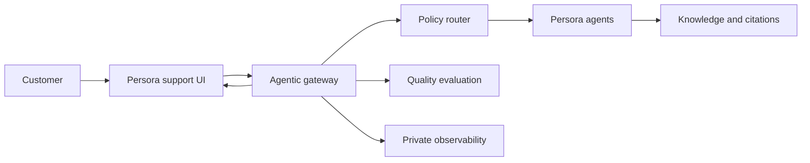

# Persora Agentic Support Lab

Persora's public reference implementation for reducing unsupported AI answers, measuring agent quality and making agentic execution inspectable for enterprise teams.

[](https://github.com/ai-systems-today/persora-agentic-support-lab/actions/workflows/pages.yml)

**[Open the proof application](https://ai-systems-today.github.io/persora-agentic-support-lab/)** · **[Read the enterprise manual](https://ai-systems-today.github.io/persora-agentic-support-lab/docs/)** · **[Browse the source](https://github.com/ai-systems-today/persora-agentic-support-lab)**

> This is an independent technical demonstration built by Persora. It is not affiliated with, endorsed by or operated by Netflix. Netflix names and marks belong to their respective owner.

## What this repository proves

Enterprise AI needs more than a fluent answer. It needs evidence showing what ran, which sources supported the answer, which controls were applied and which measurements belong to that exact request.

This repository demonstrates that approach through a support scenario:

- grounded answers with exact-run citations;
- deterministic authorization checks before retrieval;
- policy-based orchestration across sequential, concurrent, specialist, handoff and bounded-recovery paths;
- AG-UI streaming and an A2A specialist exchange;
- human approval for account or payment mutations;
- deterministic grounding checks and live RAGAS-compatible evaluation;
- private Langfuse telemetry with a sanitized public projection;
- an **Explain this answer** workspace that distinguishes runtime proof from repository definitions and fixtures;
- a Playwright MCP source viewer that opens original help pages instead of copying them into the application;
- a separate Hybrid RAG cloud view for exact-run Azure embedding, Pinecone retrieval and Neo4j graph evidence.
- an orchestration-aware support handoff that distinguishes protected account-action approval from an ordinary request to contact a person;
- a fail-closed Netflix Contact Us preview that uses a fixed synthetic issue, never the customer conversation, and labels the current evidence as mobile-width rather than claiming unverified device emulation.
- contextual **Continue conversation** questions returned by the published agent from the current user question and answer; when that agent returns no valid suggestions, the section stays hidden instead of substituting generic starters.

The implementation is a standalone evidence lab for the reliability principles used by Persora agents. It does not claim to contain every private component of `agent.persora.ai`.

## Evidence before claims

Every capability is classified using one of six labels:

| Label | Meaning |
|---|---|
| Runtime-proven | The selected run returned or measured the evidence |
| Repo-defined | The implementation exists, but this run does not prove execution |
| Fixture replay | Deterministic demonstration data, not a live execution claim |
| Not captured | The run returned no usable proof |
| Not executed | The selected path did not run the capability |
| Not evaluated | No valid evaluation result exists |

Pinecone and Neo4j are implemented in the separate Hybrid RAG route and are presented as executed only when the selected run captures their returned records and timing. Milvus and Apache AGE remain documented alternatives and are not presented as executed.

## Architecture at a glance



The browser receives answers, citations and an allow-listed evidence projection. Service credentials, raw private traces and evaluation credentials remain server-side.

## Start here

| Goal | Resource |
|---|---|
| Understand the purpose | [Manual introduction](https://ai-systems-today.github.io/persora-agentic-support-lab/docs/) |
| Learn the terminology | [Glossary](https://ai-systems-today.github.io/persora-agentic-support-lab/docs/GLOSSARY/) |
| Follow one request end to end | [Agent lifecycle](https://ai-systems-today.github.io/persora-agentic-support-lab/docs/LIFECYCLE/) |
| Understand hallucination controls | [Grounding and RAG](https://ai-systems-today.github.io/persora-agentic-support-lab/docs/GROUNDING/) |
| Understand the measurements | [Quality and evaluation](https://ai-systems-today.github.io/persora-agentic-support-lab/docs/QUALITY/) |
| Compare storage and graph options | [Technology decisions](https://ai-systems-today.github.io/persora-agentic-support-lab/docs/TECHNOLOGY_DECISIONS/) |

## Run locally

```bash
npm ci
npm run dev
```

Fixture mode requires no provider account or private credential. Live and agentic modes call published server endpoints and preserve visible failures instead of silently substituting fixtures.

## Build and validate

```bash
npm test
npm run validate:release
npm run build
python -m pip install --requirement requirements-docs.txt
mkdocs build --strict --site-dir dist/docs
```

Every push to `main` validates the application and Edge Functions, builds the Vite application, builds the manual into `dist/docs`, and publishes one GitHub Pages artifact.

## Current execution truth

| Capability | Repository status |
|---|---|
| Published Persora agents and citations | Executed by live/agentic modes |
| LangGraph | Implemented in `agentic-support-demo` |
| Deterministic authorization guardrail | Runs before retrieval on the agentic path |
| Deterministic grounding evaluation | Evaluates the displayed published-agent result |
| Live RAGAS-compatible evaluation | Evaluates the exact question, answer and contexts |
| AG-UI | Streams run, step, text and custom evidence events |
| A2A | Executes Agent Card discovery and `message:send` on the specialist route |
| Langfuse | Server-side export and sanitized read-back are implemented |
| Playwright MCP | Implemented by the source-browser Edge Function; execution is runtime-dependent |
| Human contact request | Uses the handoff pattern in `contact-requested` mode; offers official sources without creating a mutation approval |
| Contextual follow-ups | Forwarded from the published agent; absent on generation, parsing or request failure |
| Supabase/Postgres vector retrieval | Reused through the current Persora knowledge path |
| Pinecone | Hybrid RAG adapter implemented; execution is shown only when the selected run returns records/evidence |
| Neo4j Aura | Bounded graph adapter implemented; execution is shown only when the selected run returns backend evidence |
| Milvus / Apache AGE | Documented alternatives; not executed here |
| `pg_graphql` | API exposure option, not a graph database and not retrieval proof |

The [technology stack chapter](docs/TECH_STACK.md) maps every component to its actual role and evidence status. The [Milvus enterprise chapter](docs/MILVUS_ENTERPRISE.md) explains when Kubernetes/AKS is justified, why Azure Container Apps is an application tier rather than managed Milvus, and how to migrate with parity testing and rollback.

For a short, reliable product walkthrough, use the [interview demonstration runbook](docs/INTERVIEW_DEMO.md).

## Public repository status

The repository contains browser-safe public identifiers but no service-role, Azure OpenAI, Langfuse-secret or Playwright-MCP credentials. See [Public safety](docs/PUBLIC_SAFETY.md) and [Security policy](SECURITY.md).

The repository is public for inspection and currently has no open-source `LICENSE`. Public visibility does not grant permission to reuse the code or brand assets.
