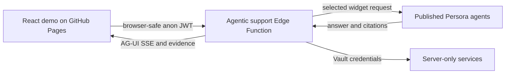

# Architecture

## System boundary

`Services` includes the private Langfuse project, Azure OpenAI evaluator and Playwright MCP endpoint. Their credentials and private URLs are not sent to the browser.

## Answer modes

| Mode | Request path | What it proves |
|---|---|---|
| Demo replay | Local deterministic case | UI and fixture evidence only |
| Live answer | Browser to published Persora agent | Returned answer and citations; no demo LangGraph claim |
| Full agentic run | Browser to `agentic-support-demo` | Returned routing, LangGraph nodes, protocol events, integrations and exact-run evaluation |

## Agentic request lifecycle

1. Validate origin, JWT and request shape.
2. Apply rate limiting and deterministic authorization guardrails.
3. Select sequential, concurrent, group-chat, handoff or bounded-recovery routing.
4. Execute the appropriate LangGraph nodes and, when required, the A2A specialist exchange.
5. Call the selected published Persora agent and preserve its answer and citations.
6. Evaluate the exact question, displayed answer and returned contexts.
7. Export private telemetry using server-side credentials and return only the allow-listed public projection.
8. Stream AG-UI events and same-run evidence to the browser.

## Trust boundaries

- **Browser-safe:** public application code, Supabase anon JWT, published widget identifiers, answers, citations and sanitized evidence.
- **Server-only:** service-role credentials, Azure OpenAI credentials, Langfuse secret key, Playwright MCP URL, raw private telemetry and Vault access.
- **Never inferred:** optional technology execution, retrieval success, orchestration topology or evaluation success without same-run evidence.

## Main implementation locations

| Area | Path |
|---|---|
| Chat and Explain UI | `src/App.tsx` |
| Browser streaming client | `src/liveClient.ts` |
| Agentic orchestration | `supabase/functions/agentic-support-demo/index.ts` |
| Specialist A2A endpoint | `supabase/functions/netflix-specialist-a2a/index.ts` |
| Source browser | `supabase/functions/support-source-browser/index.ts` |
| Routing policy | `supabase/functions/_shared/orchestrationRouter.ts` |
| Exact-run evaluation | `supabase/functions/_shared/liveRagEvaluation.ts` |
| Release validation | `scripts/validate_release.mjs` |
