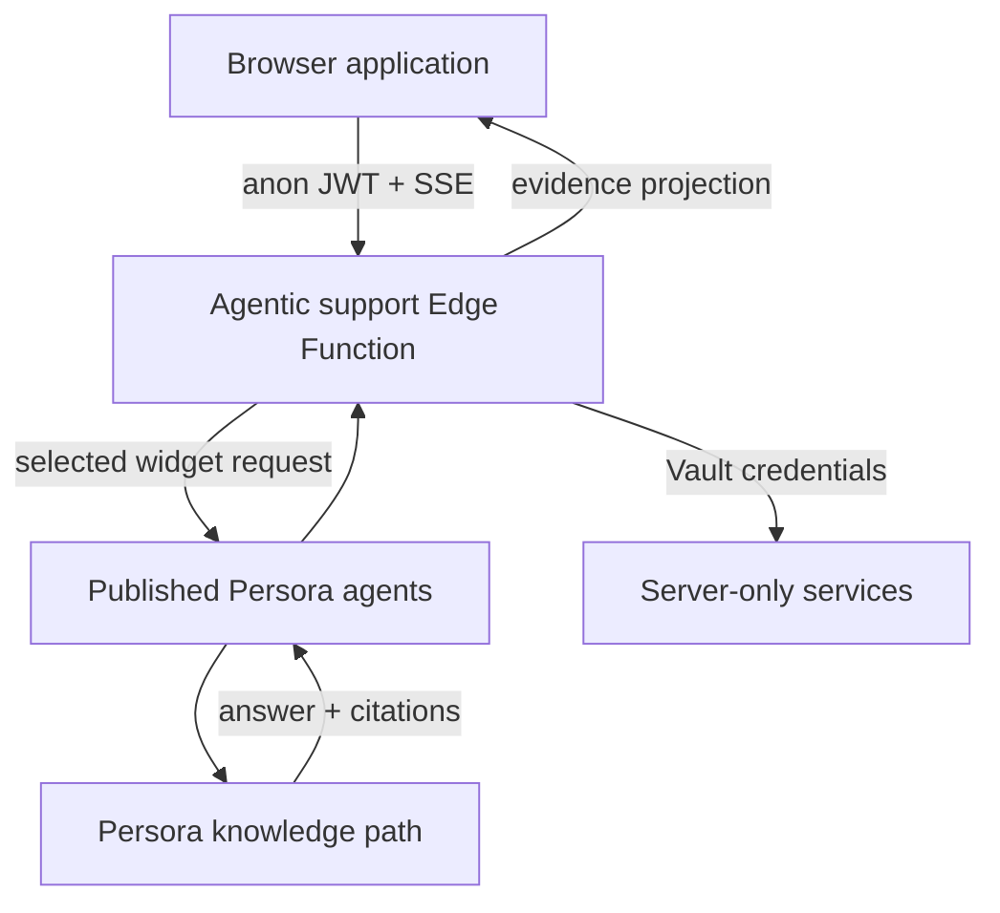
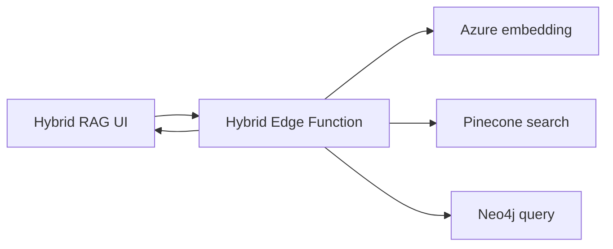

# Architecture

## System boundary

`S` includes the Azure OpenAI evaluator, private Langfuse project and Playwright MCP endpoint. Their credentials and private URLs are not returned to the browser.

## Hybrid RAG boundary

The Hybrid RAG page is a parallel demonstration route. Pinecone supplies ranked chunks; Neo4j supplies bounded relationships with provenance. Neither backend silently replaces the existing Persora knowledge path. Milvus and Apache AGE remain alternatives until a captured run proves their execution.

## Five architecture layers

| Layer | Responsibility | Examples |
|---|---|---|
| Orchestration | Decide what runs and in what order | LangGraph, routing policy, specialist selection, handoff |
| Content and data | Supply approved evidence | Persora KB, citations, retrieval records |
| Interaction | Move structured state between agents and UI | AG-UI, A2A, SSE, MCP |
| Observability | Record what happened operationally | traces, spans, timings, Langfuse projection |
| Quality | Measure whether the result is supported and useful | deterministic checks, RAGAS-compatible metrics |

## Answer modes

| Mode | Path | Valid claim |
|---|---|---|
| Demo replay | Local fixture | The UI and fixture evidence can be demonstrated repeatably |
| Live answer | Browser → published agent | The returned answer and citations came from the live request |
| Full agentic run | Browser → Edge Function → graph → agent | Returned route, nodes, protocols and evaluation belong to the run |

## Trust boundaries

**Browser-safe:** public application code, anon JWT, published widget identifiers, answers, citations and sanitized evidence.

**Server-only:** service-role and Azure credentials, Langfuse secrets and raw traces, Playwright MCP internal URL, Vault contents and signing secrets.

**Never inferred:** adapter execution from a diagram, retrieval success from a provider name, topology from the visual alone, or evaluation success without a valid result.

## Repository isolation

The lab is standalone. It neither imports nor modifies LibreChat. It is also not a source-code mirror of every private `agent.persora.ai` service. Its purpose is to make the reliability and evidence contracts independently inspectable.

## Main implementation locations

| Concern | Location |
|---|---|
| Chat and Explain UI | `src/App.tsx` |
| Browser streaming | `src/liveClient.ts` |
| Runtime evidence types | `src/types.ts` |
| Agentic graph | `supabase/functions/agentic-support-demo/index.ts` |
| Policy router | `supabase/functions/_shared/orchestrationRouter.ts` |
| Specialist router | `supabase/functions/_shared/specialistRouter.ts` |
| Deterministic quality | `supabase/functions/_shared/answerQuality.ts` |
| RAGAS-compatible evaluation | `supabase/functions/_shared/liveRagEvaluation.ts` |
| A2A endpoint | `supabase/functions/netflix-specialist-a2a/index.ts` |
| Playwright source browser | `supabase/functions/support-source-browser/index.ts` |
| Hybrid RAG UI and client | `src/HybridRagPage.tsx`, `src/hybridRagClient.ts` |
| Neo4j relationship visualization | `src/RelationshipGraph.tsx`, `src/relationshipGraph.ts` |
| Pinecone and Neo4j backend adapters | `supabase/functions/hybrid-rag-demo/index.ts` |

For a layer-by-layer inventory, see [Technology stack](TECH_STACK.md).
