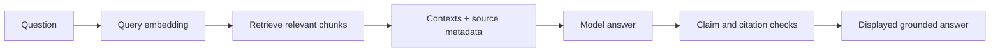

# Grounding and RAG

Grounding connects an answer to approved evidence. RAG is one mechanism for supplying that evidence; grounding also requires citation handling, claim checks and honest failure behavior.

## The RAG loop

## What retrieval proves—and does not prove

Retrieval can prove that records were returned. It does not automatically prove that:

- the returned records were relevant;
- the model used them correctly;
- every factual answer claim is supported;
- the most important evidence was retrieved;
- access controls were appropriate.

Those questions require separate measurements and controls.

## Current retrieval path

The lab reuses citations returned by the published Persora agent and identifies the provider as Persora KB with Supabase/Postgres vectors. It does not perform a second hidden retrieval against Pinecone, Milvus or Neo4j.

## Deterministic grounded-claim filtering

The quality layer breaks the answer into claims, reads citation references and compares substantive terms against cited source text. A factual line is retained only when its claims have valid, supported references. Negative claims use a stricter overlap threshold because words such as “not” can reverse meaning.

This is intentionally conservative. Lexical support is inspectable, but it does not understand every paraphrase. The model-based evaluator complements it rather than replacing it.

## Citation quality

A useful citation needs more than a URL:

- a valid index;
- source title or label;
- source URL when available;
- the returned snippet or context;
- a clear relationship to the answer claim.

The source workspace can open the original help page through Playwright MCP, letting a reviewer compare the cited material with the current source page.

## Common failure modes

| Failure | Response |
|---|---|
| No citations returned | Do not claim grounded retrieval |
| Citation number outside the returned list | Mark citation validity failure |
| Context exists but does not support the claim | Remove or flag the unsupported claim |
| Relevant answer but weak evidence | Separate relevancy from faithfulness |
| Unknown question with no trusted reference | Run reference-free metrics; mark reference metrics not applicable |
| Live provider fails | Show the failure; do not substitute a fixture silently |

## Hallucination-reduction controls

1. approved knowledge corpus;
2. authorization before retrieval;
3. bounded specialist selection;
4. returned citations from the exact agent call;
5. deterministic claim/source checks;
6. model-based exact-run evaluation;
7. human approval for consequential actions;
8. traceable prompts, routes and versions.
