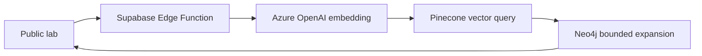

# Hybrid RAG cloud view

## Purpose

The Hybrid RAG page demonstrates a separate retrieval route without changing the existing Netflix support-agent workflow. It visualizes which cloud services executed for one selected request and keeps provider credentials server-side.

## Request path

The Edge Function validates the question, applies the shared entry rate limit, generates the 1,536-dimensional query embedding, queries the repository-defined `netflix-support-v1` Pinecone namespace, extracts bounded support topics and queries Neo4j relationships for those topics through the official Neo4j driver.

## Evidence contract

Each backend returns a separate evidence record:

| Field | Meaning |
|---|---|
| `backend` | Azure OpenAI, Pinecone or Neo4j |
| `executed` | The backend request completed successfully for this run |
| `durationMs` | Server-measured backend duration |
| `records` | Returned embeddings, vector matches or graph facts |
| `error` | Sanitized failure or non-execution reason |

The interface never turns a node green from configuration or fixture data. A failed backend remains visibly not executed, and no fixture is substituted.

## Security boundary

The browser contains only the existing Supabase publishable key and the public function URL. These secrets remain in the Supabase project:

- `AZURE_OPENAI_ENDPOINT`
- `AZURE_OPENAI_API_KEY`
- `AZURE_OPENAI_EMBED_DEPLOYMENT`
- `AZURE_OPENAI_API_VERSION`
- `PINECONE_API_KEY`
- `PINECONE_INDEX_HOST`
- `NEO4J_URI`
- `NEO4J_USERNAME`
- `NEO4J_PASSWORD`

The function uses an origin allow-list, request-size validation, the shared entry rate limit, no-store responses and sanitized provider errors.

## Deployment and verification

1. Configure the server-side secrets in the Supabase project.
2. Deploy `supabase/functions/hybrid-rag-demo/index.ts`.
3. Open the public lab and select **Hybrid RAG**.
4. Run a question such as “How does Netflix Household work while travelling?”
5. Confirm Azure OpenAI and Pinecone show exact-run evidence.
6. Confirm Neo4j shows returned relations or a visible bounded non-execution reason.
7. Confirm source URLs open the original Netflix Help pages.
8. Confirm a provider failure stays visible and does not produce fixture results.
