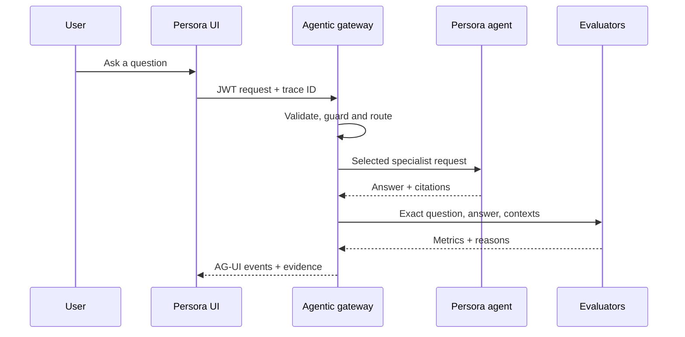

# Request lifecycle

This chapter follows one agentic request from the browser to the evidence drawer.

## End-to-end stages

## Stage 1: intake

The browser creates a trace identifier and sends the question, session token and device identifier. The server validates method, origin, JWT and request shape before agent work begins.

**Why it matters:** malformed or unauthorized traffic should not reach expensive model and retrieval services.

## Stage 2: authorization guardrail

The deterministic guardrail looks for requests that cross privacy or authority boundaries. A request for another account's billing information is blocked before retrieval. A mutation request is routed to a human-approval state rather than treated as completed.

**Evidence:** the run returns an allow/block decision and reason.

## Stage 3: orchestration selection

The policy router chooses sequential, concurrent privacy checks, an A2A specialist group, human handoff or a bounded recovery planner.

**Evidence:** selected pattern, matched signals, reason and confidence.

## Stage 4: specialist selection

The server selects Billing, Household & Travel, Account Access & Security, or the general support agent. Multi-domain requests can select multiple specialists.

**Evidence:** agent name, domain, agent identifier and widget identifier returned for the run.

## Stage 5: knowledge retrieval and generation

The published Persora agent retrieves from the current knowledge path and returns its answer with citations. The agentic layer preserves this result rather than silently replacing it with a different answer.

## Stage 6: deterministic quality checks

The server checks claim support, citation indices, relevance and required-intent coverage. Unsupported factual lines can be removed from the displayed grounded result.

## Stage 7: RAGAS-compatible evaluation

The evaluator receives the exact question, displayed answer and returned contexts. Reference-free metrics run for new questions. Reference-dependent metrics remain not applicable when no approved reference exists.

## Stage 8: observability

The server records node timings and exports private telemetry when configured. The browser receives only the public projection allowed by the contract.

## Stage 9: response and explanation

AG-UI events stream progress and evidence to the browser. The user sees the answer first and may open **Explain this answer** to inspect the route, sources, measurements and missing evidence.

## Failure behavior

Failures remain visible. Live mode does not silently turn into a fixture. Missing trace read-back becomes `pending` or `unavailable`; missing evaluation becomes `Not evaluated`.
