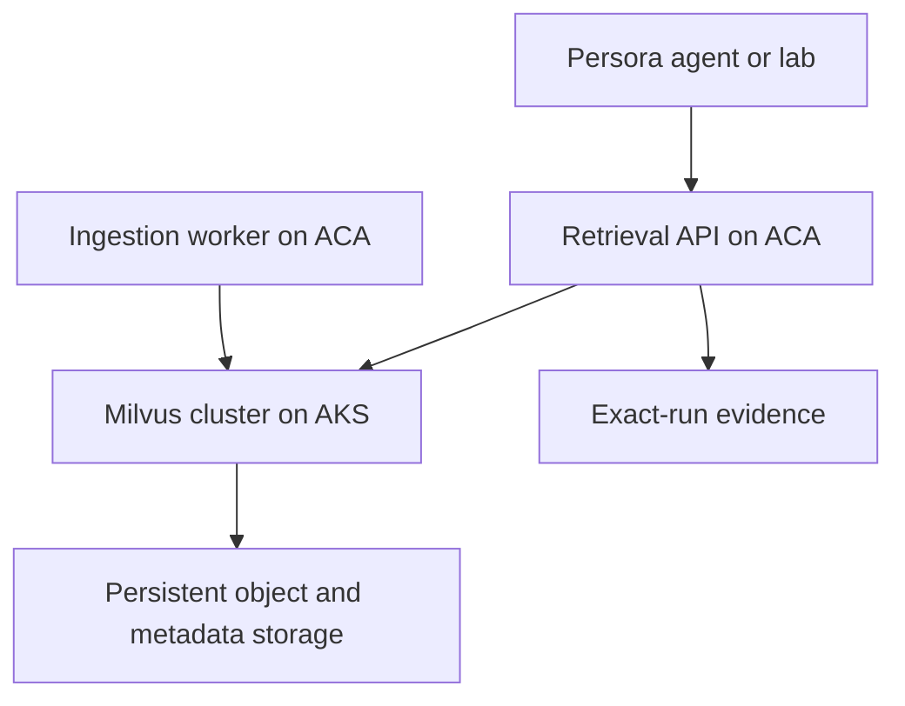

# Milvus for enterprise workloads

## Current status

Milvus is **not executed by this repository**. Pinecone is the demonstrated dedicated vector service, while the existing Persora product path uses Supabase/Postgres vectors. This chapter defines when Milvus would become justified and how to introduce it without weakening the evidence contract.

## When we would choose Milvus

Consider Milvus when evidence shows that the organization needs one or more of these capabilities:

- a self-hosted or privately controlled vector platform;
- dedicated vector infrastructure at a scale or throughput the current path cannot meet;
- Kubernetes-native placement, scaling and operational policy;
- data-residency or network-isolation requirements that exclude a hosted vector service;
- workload-specific indexing and tuning backed by a reproducible quality/latency benchmark.

Do not adopt it solely because the workload is described as “enterprise.” The trigger must be measured against Postgres/pgvector and Pinecone using the same corpus, filters and evaluation questions.

## Correct Azure deployment choices

| Choice | Use it for | Responsibility | Recommendation |
|---|---|---|---|
| Azure Kubernetes Service (AKS) | A self-hosted distributed Milvus cluster | The team owns Milvus lifecycle, storage, upgrades, backups and tuning; Azure manages the Kubernetes control plane and offers managed operating modes | Preferred Azure path when self-hosted Milvus is required |
| Azure Container Apps (ACA) | Stateless retrieval APIs, ingestion workers, rerankers and adapters around the vector store | Azure abstracts the underlying container infrastructure and scaling | Good application tier; not a managed Milvus database |
| Managed Milvus service | Milvus-compatible capability without operating the cluster | The provider operates the database service | Prefer when Milvus compatibility is required but cluster operations are not a differentiator |
| Pinecone | The already implemented managed-vector path | Provider operates the vector service | Keep when it meets quality, latency, isolation and cost requirements |

Milvus documents clustered deployment on Kubernetes with Helm and provides an Azure guide based on AKS. Microsoft describes ACA as a serverless platform for containerized applications. Therefore ACA can host the API and workers that call Milvus, but it should not be described as “Milvus managed for us.” For a production distributed Milvus deployment on Azure, AKS or a managed Milvus provider is the defensible choice.

Authoritative references:

- [Milvus: install a cluster with Helm](https://milvus.io/docs/install_cluster-helm.md)
- [Milvus: deploy on Azure with AKS](https://milvus.io/docs/azure.md)
- [Microsoft: Azure Container Apps overview](https://learn.microsoft.com/en-us/azure/container-apps/overview)
- [Microsoft: Azure Kubernetes Service overview](https://learn.microsoft.com/en-us/azure/aks/what-is-aks)

## Reference architecture

ACA and AKS are alternatives for different responsibilities, not competing names for the same service. A smaller deployment may omit ACA and expose a private retrieval API inside AKS. A managed Milvus service may replace the AKS and storage boxes entirely.

## Safe migration from the current proof

1. Define a provider-neutral retrieval contract matching the current question, vector, filters, top-k results, scores, source identifiers and timing evidence.
2. Load the same 884 verified Netflix chunks and the same 1,536-dimensional embeddings into a versioned Milvus collection.
3. Run offline parity tests against Pinecone and Postgres using fixed questions and approved quality metrics.
4. Shadow live queries without using Milvus results in answers; record only sanitized aggregate comparison evidence.
5. Require acceptance thresholds for recall/quality, p50/p95 latency, filtering, failure rate, cost and recovery.
6. Enable a bounded feature flag for selected traffic while retaining the existing provider as rollback.
7. Declare Milvus runtime-proven only when the selected run captures its actual query, returned records and duration.

## Fail-safe requirements

- Keep credentials and private endpoints server-side.
- Use collection and schema versions; never overwrite the known-good index during migration.
- Make ingestion idempotent and verify record counts and source identifiers.
- Preserve tenant and metadata filters in parity tests.
- Set query timeouts and bounded retries; surface failures instead of substituting fixtures.
- Monitor index health, capacity, latency and failed writes.
- Test backup/restore and rollback before production cutover.
- Keep answer evaluation independent of the vector provider so quality comparisons remain fair.

## Evidence needed before adoption

Milvus becomes a recommended implementation only after a benchmark demonstrates a material advantage or satisfies a mandatory governance constraint. Until then, its status remains **Alternative; not executed**.
