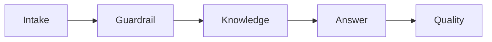

# Orchestration

Orchestration is the controlled selection and coordination of steps, tools and agents. A flowchart is not execution; the server must return evidence of the route that ran.

## Policy routing

| Pattern | Trigger in this implementation | Purpose |
|---|---|---|
| Sequential | One ordinary support intent | Retrieve, answer and evaluate in order |
| Concurrent | Sensitive cross-account or billing-data request | Run independent privacy and safe-alternative checks |
| Group chat | Two or more support domains | Gather matching A2A specialist contributions |
| Handoff | Account/payment mutation | Pause for authenticated human approval |
| Magentic/bounded recovery | Failed or repeated recovery attempt | Plan a next step with a strict revision limit |

## Sequential

Use sequential orchestration when later steps depend on earlier results. It is simple to inspect and appropriate for one grounded intent.

## Concurrent privacy checks

Independent checks can run together. The repository records start time, finish time and overlap. Concurrency is proved only when measured overlap is positive.

## A2A specialist group

A multi-domain request can select Billing, Household/Travel and Identity/Access specialists. The service discovers the Agent Card, sends an A2A `message:send` request and returns a bounded task artifact.

## Human handoff

Requests to cancel, refund, close or otherwise mutate an account require approval. Approval changes orchestration state; it does not prove that an external Netflix mutation occurred.

## Bounded recovery

The planner is limited to a maximum number of iterations. It may finish immediately or revise once after a reported failure. The bound prevents an uncontrolled loop.

## Why deterministic routing here?

Route signals are explicit policies. That choice provides repeatability, direct tests and a visible reason. A learned router would require a labelled dataset, evaluation thresholds, fallback behavior and versioned evidence.

## What one run should return

- selected pattern, reason, matched signals and confidence;
- selected specialist identities;
- node trace and protocol events;
- concurrency or recovery proof where applicable.
