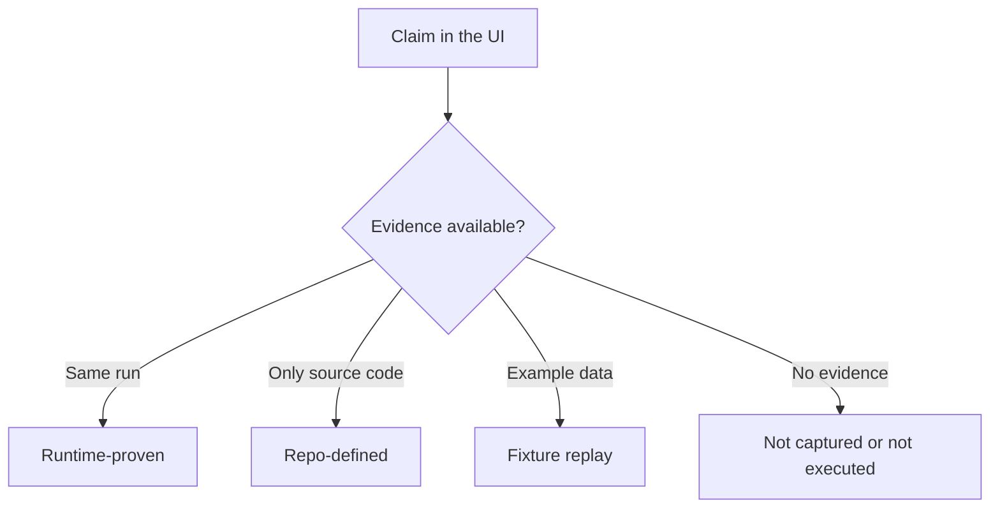

# Philosophy: evidence before claims

Persora treats reliability as a chain of independently inspectable controls. No single model, prompt, vector database or score makes an agent trustworthy.

## The five principles

### 1. Ground the answer

The agent should answer from approved knowledge and return the sources used. If evidence is insufficient, a safe response is better than invented certainty.

### 2. Measure the exact run

Evaluation must use the question, displayed answer and contexts from the same run. Scores copied from another question or a static benchmark do not describe the current answer.

### 3. Route by policy

Requests that involve privacy, account mutation, multiple domains or failed recovery attempts need different workflows. Routing is a controlled policy decision, not a decorative graph.

### 4. Make absence visible

Missing telemetry, unavailable evaluation and unexecuted adapters remain visible. The interface does not silently replace a failed live result with a successful fixture.

### 5. Explain without exposing hidden reasoning

Operators need evidence, not private chain-of-thought. Persora exposes routes, nodes, citations, metrics, timings and sanitized observations while keeping hidden reasoning, credentials and raw private traces private.

## Hallucination reduction, not a perfect-answer promise

“Hallucination” is commonly used for unsupported or fabricated model output. An enterprise system reduces this risk through layers:

- approved knowledge;
- retrieval and citations;
- deterministic authorization rules;
- grounded-claim filtering;
- exact-run evaluation;
- human approval for consequential actions;
- monitoring and review.

These controls reduce risk and improve detection. They do not justify claiming that every answer will always be correct.

## A practical evidence hierarchy

The status belongs to a specific fact. One run may prove LangGraph execution while leaving Langfuse read-back pending.
