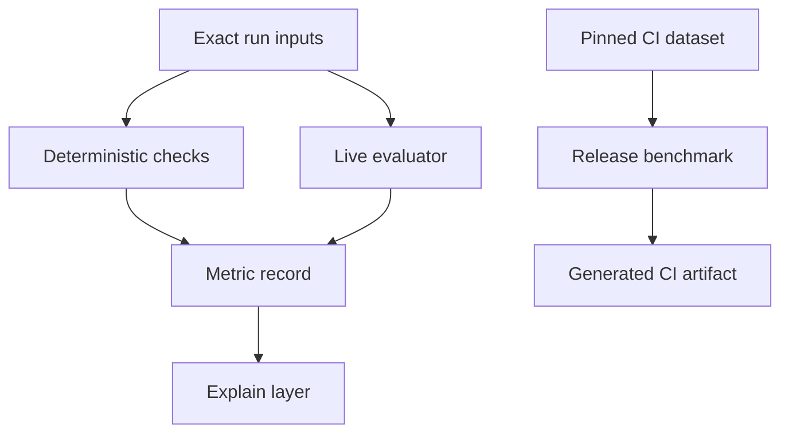

# Quality and evaluation

Quality is not one number. Persora keeps deterministic checks, model-based evaluation and release benchmarks separate so each result retains its meaning.

## Three evaluation layers

| Layer | Runs when | Purpose |
|---|---|---|
| Deterministic answer quality | Each generated agentic knowledge answer | Inspect citations, lexical grounding, relevancy and intent coverage |
| Live RAGAS-compatible evaluation | Each eligible generated answer | Evaluate the exact question, displayed answer and contexts |
| Python RAGAS release benchmark | CI | Detect contract regressions on a pinned dataset |

The CI artifact never populates a live answer's metrics.

## Deterministic metrics

### Grounding

Ratio of supported factual claims to identified factual claims. It asks whether answer statements have source support under the deterministic method.

### Citation validity

Ratio of referenced citations that resolve to returned citation records.

### Answer relevance

Checks whether the answer overlaps the substantive intent of the question. Relevance is not the same as factual support.

### Intent coverage

For multi-part questions, checks how many required intents were addressed.

## RAGAS-compatible metrics

### Faithfulness

Are the answer's claims supported by the supplied contexts?

### Response relevancy

Does the answer address the question directly and usefully?

### Context precision

How much of the retrieved context contributes useful evidence?

### Context recall

Does the retrieved context contain the information needed by the trusted reference answer? This needs an approved reference.

### Factual correctness

Does the displayed answer agree with an approved trusted reference? New questions without a reference receive `null`/not applicable—not an invented score.

## Exact-run integrity

The evaluation record includes:

- implementation and evaluator version;
- evaluator model when executed;
- question, answer and context hashes;
- metric values and reasons;
- unsupported claims;
- relevant context indices;
- reference identifier when applicable;
- duration and error state.

Input hashes help show which values were evaluated without exposing those values in a public trace.

## Reading scores responsibly

Do not merge all metrics into a vague “quality score.” A relevant answer can still be unsupported; a faithful answer can still omit an intent. Keep metric names, methods, versions and missing values visible.

## Evaluation lifecycle

