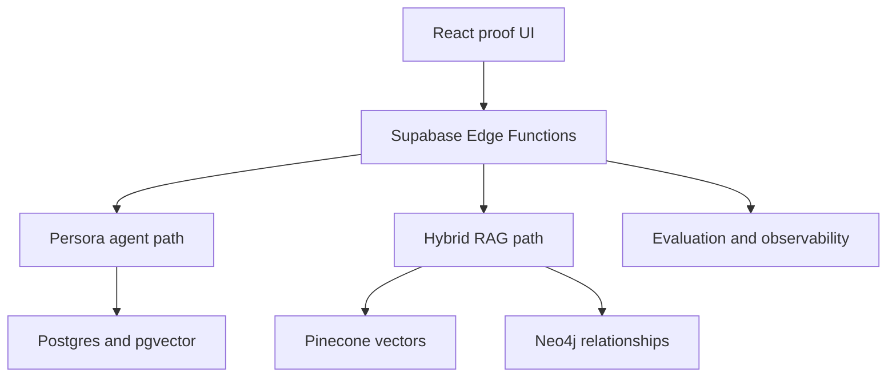

# Technology stack

This chapter maps each technology to the job it performs in the Persora proof. It separates implemented code, runtime-dependent integrations and deliberate alternatives so a diagram is never mistaken for execution evidence.

## Status language

| Status | Meaning |
|---|---|
| Implemented | The repository contains the integration and tests or validation for it |
| Runtime-dependent | Implemented, but a specific run proves execution only when it returns exact-run evidence |
| Demonstrated | A captured staging run returned successful backend evidence |
| Alternative | Documented for a future requirement; not executed by this application |

## Stack at a glance

| Layer | Technology | How this proof uses it | Why it is here | Status |
|---|---|---|---|---|
| Experience | React, TypeScript, Vite | Chat, Explain drawer, Hybrid RAG view and accessible evidence graph | Typed, inspectable UI with a small static deployment surface | Implemented |
| Documentation | MkDocs Material | This learner-oriented manual and its navigation/search | Versioned documentation beside the implementation | Implemented |
| API/runtime | Supabase Edge Functions (Deno) | Public server boundary, streaming, orchestration and provider calls | Keeps privileged credentials and policy enforcement outside the browser | Implemented |
| Relational/vector data | Supabase Postgres and pgvector | Existing Persora knowledge path, metadata and vector retrieval | One governed data plane for the product path | Runtime-dependent |
| Embeddings/evaluation | Azure OpenAI | Creates 1,536-dimensional Hybrid RAG query vectors and powers the server-side evaluator | Managed model access behind the server boundary | Runtime-dependent; demonstrated in staging |
| Managed vector search | Pinecone | Searches the `netflix-support-v1` namespace and returns ranked Netflix chunks | Shows an independently scalable managed vector adapter | Runtime-dependent; demonstrated in staging |
| Knowledge graph | Neo4j Aura | Returns bounded topic relationships with source provenance | Demonstrates relationship retrieval that vector similarity alone does not express | Runtime-dependent; demonstrated in staging |
| Enterprise vector alternative | Milvus | Not called by this application; documented as a migration target | Self-hosted control, Kubernetes operations or large dedicated vector workloads | Alternative; not executed |
| Postgres graph alternative | Apache AGE | Not called by this application | Keeps graph data in a PostgreSQL operating model when native-graph specialization is unnecessary | Alternative; not executed |
| Orchestration | LangGraph | Executes bounded state transitions, branches and recovery paths | Makes agent routing explicit and inspectable | Implemented; execution is per-run evidence |
| Integration ecosystem | LangChain | Used through the LangGraph/LangChain package ecosystem rather than as a broad application framework | Provides compatible graph/runtime abstractions without adding unused layers | Implemented indirectly |
| Agent protocol | A2A | Discovers an Agent Card and exchanges a bounded specialist task | Makes specialist-to-specialist work explicit and verifiable | Runtime-dependent |
| UI protocol | AG-UI over SSE | Streams lifecycle, step, text and evidence events | Lets the interface show progress without inventing hidden execution | Runtime-dependent |
| Tool protocol | MCP with Playwright | Opens an allow-listed original Netflix Help page at mobile width | Verifies current source presentation without copying the page into Persora | Runtime-dependent |
| Observability | Langfuse over OTLP | Receives private server-side traces; the browser gets only an allow-listed projection | Operational visibility without leaking raw prompts, outputs or identifiers | Runtime-dependent |
| Quality | Deterministic checks and RAGAS-compatible evaluation | Measures citation validity, support, relevance and exact-run inputs | Turns hallucination reduction into inspectable measurements rather than a guarantee | Implemented; result is per-run evidence |
| Delivery | Vitest, Python benchmark, GitHub Actions and Pages | Unit/contract tests, release checks, documentation and public proof deployment | Reproducible review and public demonstration | Implemented |

## How the paths fit together

The agentic support path proves orchestration, grounding, protocols, quality and handoff. The separate Hybrid RAG path proves that the same knowledge corpus can be queried through Pinecone and enriched with Neo4j relationships without changing the existing agent path.

## Job-description coverage

| Capability | Proof in this repository |
|---|---|
| LangGraph orchestration | Bounded server-side graph, router, specialists and recovery evidence |
| LangChain ecosystem | LangGraph package/runtime integration; no claim that every LangChain abstraction is used |
| RAG and vector search | Product Postgres/pgvector path plus the demonstrated Pinecone adapter |
| Knowledge graphs | Demonstrated Neo4j relationship query and interactive exact-run graph |
| Agent protocols | AG-UI, A2A and MCP/Playwright with per-run evidence |
| Evaluation and observability | Deterministic checks, RAGAS-compatible evaluation and private Langfuse telemetry |
| Milvus | Architecture and migration decision documented; deliberately not executed |

Milvus is the remaining named alternative, not a missing hidden component. Adding it should be a measured infrastructure decision, not another logo in the request path. See [Milvus for enterprise workloads](MILVUS_ENTERPRISE.md).
